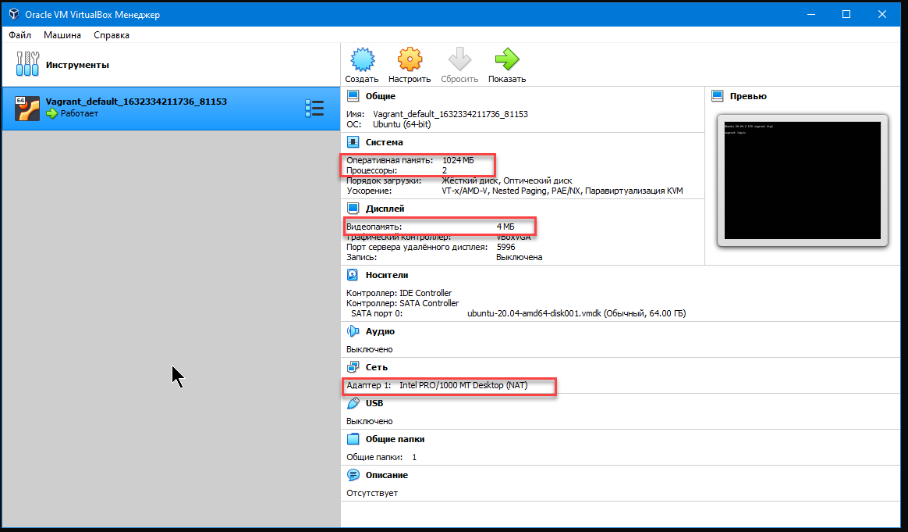
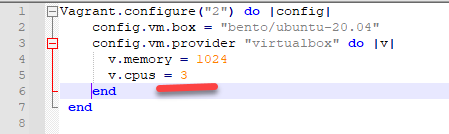
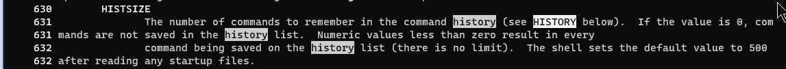
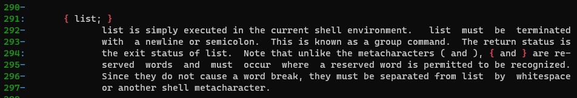
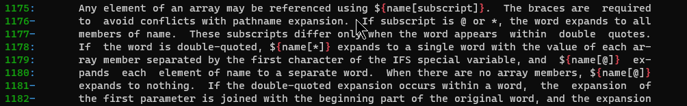
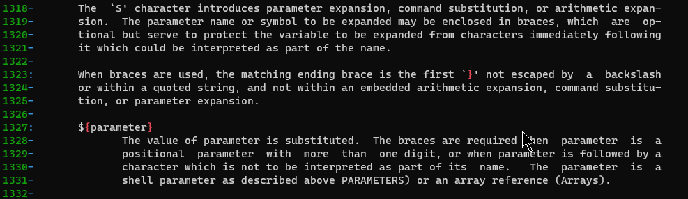
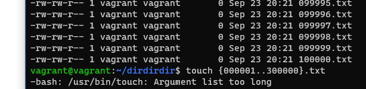
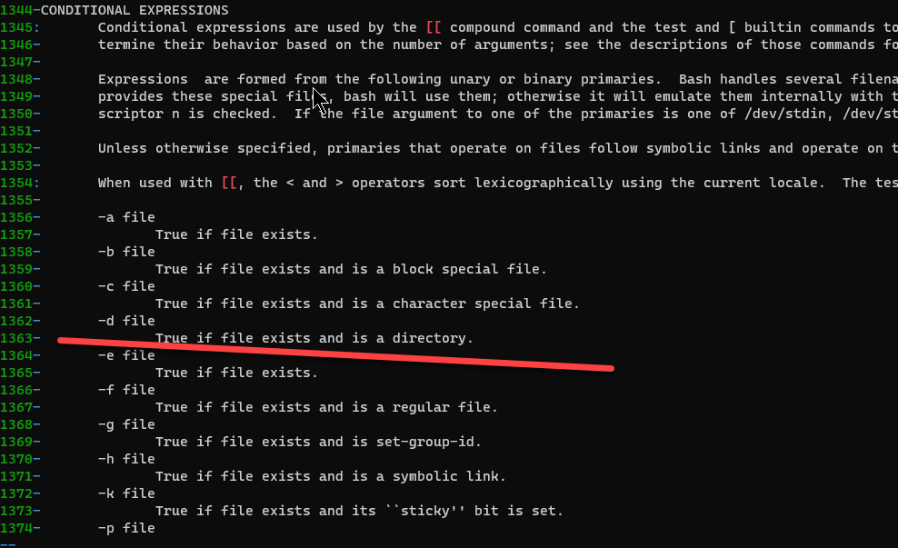
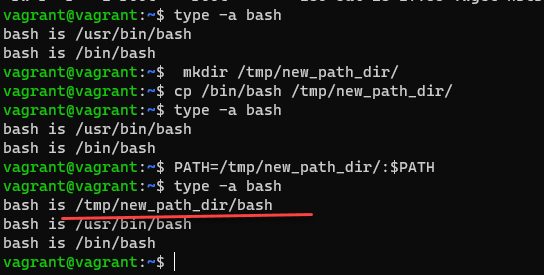
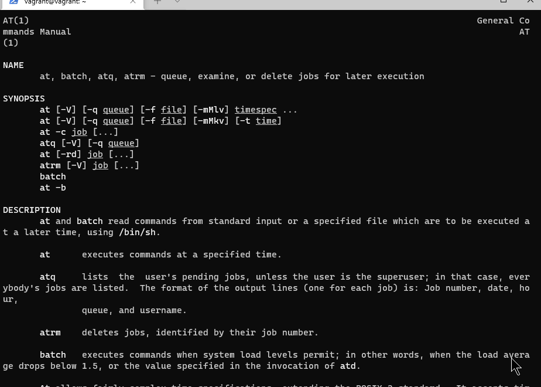

# Домашнее задание к занятию "3.1. Работа в терминале, лекция 1"

5. Ознакомьтесь с графическим интерфейсом VirtualBox, посмотрите как выглядит виртуальная машина, которую создал для вас Vagrant, какие аппаратные ресурсы ей выделены. Какие ресурсы выделены по-умолчанию?

 

6.  Ознакомьтесь с возможностями конфигурации VirtualBox через Vagrantfile: [документация](https://www.vagrantup.com/docs/providers/virtualbox/configuration.html). Как добавить оперативной памяти или ресурсов процессора виртуальной машине?

 
 Для добавления ресурсов нужно добавить следющий блок в Vagrantfile. 
```bash
config.vm.provider "virtualbox" do |v| 
v.memory = 1024  v.cpus = 2
end
```




8. Ознакомиться с разделами `man bash`, почитать о настройках самого bash:
    * какой переменной можно задать длину журнала `history`, и на какой строчке manual это описывается?

	`man bash | grep -C 10 ignoreboth`
    
    
    
    * что делает директива `ignoreboth` в bash?

	Параметр ignoreboth относится к опции HISTCONTROL которая контролирует каким образом список команд сохраняется в истории.
	ignorespace - не сохранять строки начинающиеся с пробела
	ignoredups - не сохранять строки, совпадающие с последней выполненной командой
	ignoreboth - объединяет обе опции ignorespace и ignoredups


9. В каких сценариях использования применимы скобки `{}` и на какой строчке `man bash` это описано?

Используются для группировки команд. {} являются зарезрврироваными символами.


В синтаксисе доступа к элементам масива.



Используются для подстановке значения параметра.


10. Основываясь на предыдущем вопросе, как создать однократным вызовом `touch` 100000 файлов? А получилось ли создать 300000? Если нет, то почему?

`touch {000001..100000}.txt`



11. В man bash поищите по `/\[\[`. Что делает конструкция `[[ -d /tmp ]]`
  
 `[[ -d /tmp ]]` проверяет, что /tmp существует и это каталог. Возвращает true, если это так. Используется в скриптах.
 
 
 
12. Основываясь на знаниях о просмотре текущих (например, PATH) и установке новых переменных; командах, которые мы рассматривали, добейтесь в выводе type -a bash в виртуальной машине наличия первым пунктом в списке:

	```bash
	bash is /tmp/new_path_directory/bash
	bash is /usr/local/bin/bash
	bash is /bin/bash
	```

	(прочие строки могут отличаться содержимым и порядком)
    В качестве ответа приведите команды, которые позволили вам добиться указанного вывода или соответствующие скриншоты.

 

13. Чем отличается планирование команд с помощью `batch` и `at`?

at - выполнить разово команду в опреденное время

batch - команда запускается когда уровень загрузки системы снизится ниже 1.5.

 

 
